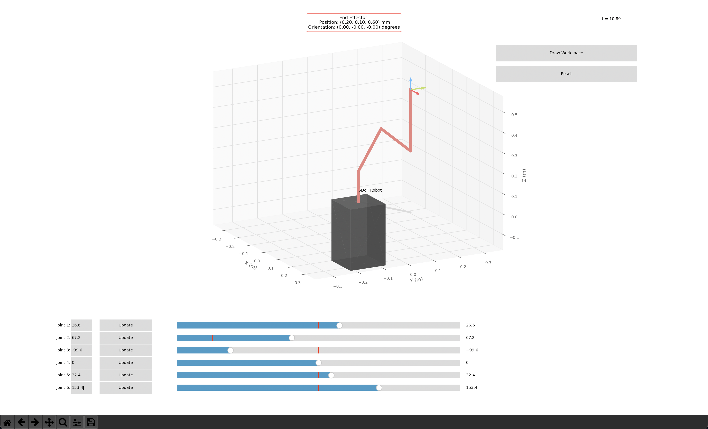

# Robot Arm Term Project (ROB-6003)

This Python script implements a 6-DOF robotic arm with forward/inverse kinematics and interactive visualization capabilities.


## Requirements

- **Download the required dependencies:**
  * [NumPy](https://numpy.org/install/)
  * [Matplotlib](https://matplotlib.org/stable/users/installing.html)
  * [Robotics Toolbox (RTB)](https://petercorke.com/toolboxes/robotics-toolbox/)


```bash
  pip install -r requirements.txt
```


## GUI Usage
- Use the textboxes or the sliders to set the desired joint variables (in degrees)
- Click the reset button to bring back the robot to its home configuration
- Click Draw Workspace to see a simulation of the robot workspace




## Class Usage

```python
from python_robot_arm import RobotArm

# Create robot instance
robot = RobotArm()

# Setup visualization
robot.setup_visualization()

# Forward kinematics example
joint_variables = [0, 0, 0, 0, 0, 0]  # in radians
end_effector_state = robot.forward_kinematics(joint_variables, print=True)

# Inverse kinematics example
target_pose = [0.3, 0.2, 0.1, 0, 0, 0]  # [x, y, z, alpha, beta, gamma]
joint_variables = robot.inverse_kinematics(target_pose)

#Display results
robot.set_joint_variables(joint_variables)
```


## Documentation

Companion derivations to understand the inverse kinematic algorithm

[Inverse Kinematic derivations](6dof_IK_derivations.pdf)


